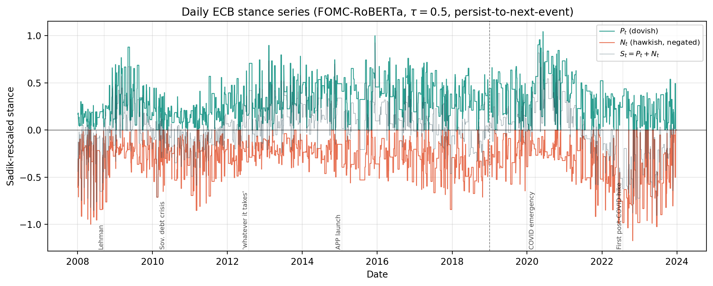
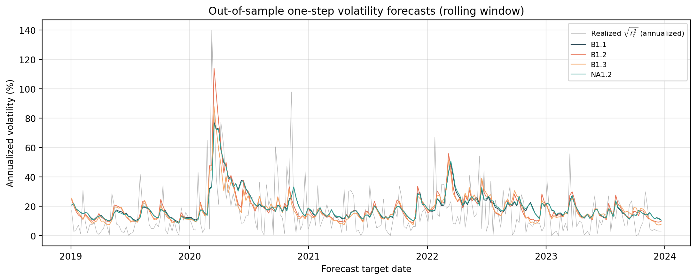

# ECB news volatility forecasting

[](https://github.com/AlessandroDeRiccardis/ecb-news-volatility-forecasting/actions/workflows/ci.yml)
[](https://www.python.org/)
[](LICENSE)

**A rigorous empirical volatility-forecasting study testing whether
transformer-classified ECB communication stance adds incremental forecasting
power beyond asymmetric GARCH benchmarks.**



## Research question

Does hawkish or dovish European Central Bank communication improve
out-of-sample Euro Stoxx 50 volatility forecasts beyond standard GARCH-family
models?

## Why this matters for quantitative finance

Central-bank communication clearly moves markets, but market impact does not
automatically imply incremental forecast value. This study tests the stronger
claim: whether a systematic text signal improves variance forecasts after
conditioning on persistent and asymmetric return dynamics. The design places a
transformer-derived macro signal inside a disciplined OOS comparison rather
than treating text classification accuracy as an economic result.

## Data overview

The empirical sample contains 4,201 Euro Stoxx 50 trading days from April 2007
through December 2023:

| Window | Dates | Trading days | Purpose |
|---|---:|---:|---|
| Pre-sample | 2007-04 to 2007-12 | 187 | initialization |
| In-sample | 2008-01 to 2018-12 | 2,754 | parameter estimation |
| Out-of-sample | 2019-01 to 2023-12 | 1,260 | forecast evaluation |

The stance corpus contains 1,159 cleaned ECB documents: Monetary Policy
Statements, Monthly and Economic Bulletins, and speeches by the ECB President
and Chief Economist. The tracked processed snapshot is
[`data/processed/model_data_master.csv`](data/processed/model_data_master.csv).
See [`data/README.md`](data/README.md) for schemas and Git policy.

## Methodology

ECB documents are cleaned, segmented into sentences, and scored with
[`gtfintechlab/FOMC-RoBERTa`](https://huggingface.co/gtfintechlab/FOMC-RoBERTa).
Sentence-level hawkish, dovish, and neutral probabilities are aggregated using:

- total document sentence count as the denominator;
- equal document weights on multi-document days;
- persist-to-next-event daily smoothing;
- in-sample-maximum rescaling following Sadik, Date and Mitra (2018);
- separate non-negative dovish `P_t` and non-positive hawkish `N_t` inputs.

The main specification uses a `0.50` classifier-confidence threshold.

## Model specifications

The benchmark suite contains GARCH(1,1), GJR-GARCH(1,1), and EGARCH(1,1).
News-augmented variants multiply the GARCH recursion by a nonlinear stance
scaling factor:

```text
sigma_t^2 = f(P_{t-1}, N_{t-1})
            * (omega + alpha * epsilon_{t-1}^2 + beta * sigma_{t-1}^2)
```

The code uses `B2.1` and `B2.2`; the paper calls the same models `NA1.1` and
`NA1.2`.

| Code ID | Paper ID | Model |
|---|---|---|
| `B1.1` | `B1.1` | GARCH(1,1) |
| `B1.2` | `B1.2` | GJR-GARCH(1,1) |
| `B1.3` | `B1.3` | EGARCH(1,1) |
| `B2.1` | `NA1.1` | NA-GARCH with net stance |
| `B2.2` | `NA1.2` | NA-GARCH with separate dovish/hawkish inputs |

## Forecasting design

Models are re-estimated at weekly forecast origins over 2019-2023. The study
evaluates rolling and increasing estimation windows at one- and five-day
horizons. Multi-step NA-GARCH forecasts hold the latest observable stance
constant, matching the persistence rule. Training windows never contain data
after the forecast origin.

## Evaluation metrics

- Patton QLIKE, the primary loss because it is robust to noisy variance proxies;
- RMSE, reported as a secondary metric;
- Diebold-Mariano tests with Newey-West correction at `h=5`;
- 90% Hansen-Lunde-Nason Model Confidence Sets;
- forecast combinations of GJR and NA-GARCH-asym;
- regime sub-samples and robustness variants.

## Main empirical result

ECB stance does **not** improve OOS volatility forecasts relative to asymmetric
GARCH benchmarks. This is an informative empirical null result.

- EGARCH records the lowest QLIKE in all four main `(scheme, horizon)` cells.
- GJR and EGARCH are the only models retained by every 90% Model Confidence Set.
- NA-GARCH-asym is significantly worse than GJR in all four DM comparisons.
- The QLIKE-minimizing forecast-combination weight on NA-GARCH-asym is `0.00`
  in all four cells.
- The fitted NA-GARCH-asym news scaling spans only `4.46%` of its no-news
  baseline across the in-sample support.



## Robustness checks

The null survives alternative communication sources, classifier thresholds,
Gaussian versus Student-t innovations, absolute returns as the volatility
proxy, sub-sample evaluation, MPS surprise construction, and Bernoth-style
residualized stance surprises.

## Repository structure

```text
.
├── configs/                  # research and runtime settings
├── data/                     # documented data layers
├── legacy/                   # unchanged supplied scripts for traceability
├── notebooks/                # intentionally empty; no hidden notebook state
├── paper/                    # accompanying final paper
├── reports/                  # supplied final tables, figures, and summary
├── scripts/                  # supported command-line entry points
├── src/ecb_vol_forecasting/  # reusable research package
└── tests/                    # lightweight synthetic-data tests
```

See [`AUDIT.md`](AUDIT.md) for the original-file disposition and
[`REPRODUCIBILITY.md`](REPRODUCIBILITY.md) for exact availability.

## Installation

Python 3.11 or 3.12 is recommended.

```bash
git clone git@github.com:AlessandroDeRiccardis/ecb-news-volatility-forecasting.git
cd ecb-news-volatility-forecasting
python -m venv .venv
source .venv/bin/activate
make install
make test
```

Conda users can instead run:

```bash
conda env create -f environment.yml
conda activate ecb-vol-forecasting
```

## How to reproduce results

Validate the tracked processed snapshot and estimate the main models:

```bash
make data
make models
```

Regenerate forecast paths and core evaluation artifacts:

```bash
make forecasts
python scripts/make_artifacts.py
```

Run the supported processed-data-to-results workflow:

```bash
make reproduce
```

Run the supplied original modeling orchestrator against the tracked processed
snapshot:

```bash
make legacy-results
```

This legacy-compatible command most closely follows the paper workflow, but
NA-GARCH local-optimum sensitivity and the separately produced Bernoth appendix
prevent a guarantee of bit-for-bit table replication.

For a short end-to-end smoke run:

```bash
make quick
```

The full forecast suite is expensive because every model is re-estimated at
each weekly origin. Supplied final paper artifacts are already tracked under
`reports/`.

## Limitations

FOMC-RoBERTa is trained on Federal Reserve rather than ECB language. The study
does not cleanly identify communication surprises separately from policy-rate
surprises, and ECB communication is only one component of the macro news set.
The supplied snapshot also lacks raw documents, sentence scores, and per-origin
forecast CSVs, so exact raw-to-paper replication requires reacquisition and
re-scoring.

## Citation

Use [`CITATION.cff`](CITATION.cff). The accompanying paper is available at
[`paper/volatility_forecasting_with_ecb_news_stance.pdf`](paper/volatility_forecasting_with_ecb_news_stance.pdf).

This repository is a cleaned and reorganized research implementation based on
group coursework. The public repository focuses on reproducibility,
implementation quality and research presentation.

## Disclaimer

This repository is for research and educational use. It does not constitute
investment advice, does not claim trading profitability, and is not an
automated trading system.
